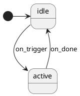

# Authoring an SRAM Module

A step-by-step guide to creating a new kbsm SRAM module, with all the
patterns and gotchas consolidated in one place.

## Quick start

The fastest way: copy the smallest module example and adapt it.

```bash
cp -r qmk/QMKata/kbsm_module_examples/kbsm_dyad qmk/QMKata/kbsm_module_examples/kbsm_mine
```

## Step-by-step

### 1. Pick a name

Short, lowercase, no QMK terminology collisions. Good: `dyad`, `holdseq`.
Bad: `combo`, `leader`, `tapdance` (these clash with QMK features).

### 2. Create the diagram (`yourname.puml`)



Generate the SM code:

```bash
~/.local/bin/statesmith run --lang C99 --no-csx --no-ask path/to/yourname.puml
```

Apply the GCC pragma guard manually (see `../../docs/installing-statesmith.md`
in the firmware repo for the snippet). Generated files are committed to the
repo so end users don't need StateSmith installed.

**StateSmith limitations in PlantUML mode (v0.21.0-alpha-1):**
- `$VARS` is **not supported** — cannot declare struct fields via the diagram.
  State lives in the adapter struct, not the generated SM struct.
- `[guard]` syntax on edge labels is **not supported** — use `<<choice>>`
  pseudo-states instead (see StateSmith wiki: "PlantUML → Layout Tip: Extra
  choice states").
- Inline comments (`'`) on edge labels cause parse errors — comment on
  separate lines.

### 3. Create the config header (`yourname_def.h`)

```c
#pragma once
#include <stdint.h>

/* ALWAYS use inline char arrays, NEVER const char * pointers.
 * GCC does not emit R_ARM_ABS32 relocations for .rodata→.rodata
 * pointer references in SRAM module builds. Pointers will reference
 * firmware flash addresses instead of the SRAM load address.
 * See docs/sram-module-relocation.md. */
#define MAX_KEY_LEN 16

typedef struct {
    char key[MAX_KEY_LEN];
    char value[128];
} yourname_def_t;

static const yourname_def_t module_config[] = {
    { "key1", "value1" },
};
#define MODULE_CONFIG_COUNT (sizeof(module_config)/sizeof(module_config[0]))

/* Keycode-to-ASCII lookup (QWERTY). Add entries for keys your module needs. */
#ifndef KC_A
#define KC_A   0x0004
/* ... other keycodes ... */
#endif

typedef struct { uint16_t kc; char ch; } keycode_char_t;

static const keycode_char_t keycode_to_char[] = {
    { KC_A,'a' }, /* ... all keys you match ... */
    { 0, 0 }
};
```

### 4. Create the adapter (`yourname_module.c`)

```c
#include "module_api.h"
#include "Yourname.h"
#include "Yourname.c"
#include "yourname_def.h"

/* State struct. Fields beyond the SM must live here (PlantUML $VARS
 * is unsupported in v0.21.0-alpha-1). */
typedef struct {
    Yourname sm;
    kbsm_env_t *env;
    /* ... your fields ... */
    bool firing;  // REQUIRED if you call tap_code16/send_string from handle()
} yourname_state_t;

/* ALWAYS explicitly initialize .bss fields in module_init().
 * SRAM modules have NO C runtime — static locals in .bss are NOT
 * zeroed at load time. They contain whatever bits were left in SRAM
 * from prior activity. */
static yourname_state_t g_state;
static kbsm_t g_machine;

/* === Helpers === */

static char keycode_to_ascii(uint16_t kc) {
    for (uint8_t i = 0; keycode_to_char[i].kc != 0; i++)
        if (keycode_to_char[i].kc == kc) return keycode_to_char[i].ch;
    return 0;
}

/* === kbsm callbacks === */

static kbsm_result_t yourname_handle(void *self, keyevent_t *event,
                                      keyrecord_t *record) {
    yourname_state_t *st = (yourname_state_t *)self;
    kbsm_env_t *env = st->env;
    uint16_t kc = env->get_record_keycode(record, true);

    /* GUARD: fire_trigger() calls tap_code16/send_string which
     * generate synthetic keyevents that re-enter this handler.
     * Skip processing while firing to avoid corrupting state. */
    if (st->firing) return KBSM_PASS;

    /* ... dispatch per state_id ... */

    return KBSM_PASS;
}

/* Optional: periodic work. NULL if not needed. */
static void yourname_tick(void *self) {
    /* ... */
}

static void yourname_reset(void *self) {
    yourname_state_t *st = (yourname_state_t *)self;
    Yourname_ctor(&st->sm);
    Yourname_start(&st->sm);
    /* Reset adapter fields */
}

/* === Lifecycle === */

static uint32_t module_init(kbsm_env_t *env) {
    if (!env) return 0xDEADBEEFu;

    /* Explicitly init every .bss field */
    g_state.env = env;
    g_state.firing = false;
    /* ... init other fields ... */

    Yourname_ctor(&g_state.sm);
    Yourname_start(&g_state.sm);

    g_machine.instance = &g_state;
    g_machine.handle   = yourname_handle;
    g_machine.tick     = NULL;    /* or yourname_tick */
    g_machine.reset    = yourname_reset;
    g_machine.name     = "yourname_sram";
    g_machine.phase    = KBSM_PHASE_PRE_TAP;
    g_machine.priority = 50;      /* pick a slot between existing modules */

    env->kbsm_register(&g_machine);
    return MODULE_INIT_MAGIC;
}

static uint32_t module_deinit(void) {
    if (g_state.env) g_state.env->kbsm_unregister(&g_machine);
    return 0;
}

static kbsm_t *machine_get(void) { return &g_machine; }

MODULE_HOOK_TABLE
const void *module_hook_table[MODULE_HOOK_MAX] = {
    [MODULE_HOOK_INIT]              = module_init,
    [MODULE_HOOK_DEINIT]            = module_deinit,
    [MODULE_KBSM_HOOK_GET_MACHINE]  = machine_get,
};
```

### 5. Register in the build script

In the firmware repo, add an entry to `emulator/scripts/build_sram_module.py`:

```python
FEATURES = {
    ...
    "yourname": {
        "dir":           "kbsm_yourname",
        "sources":       ["Yourname.c", "yourname_module.c"],
        "headers":       ["Yourname.h", "yourname_def.h"],
        "strip_include": '#include "Yourname.c"\n',
        "output_stem":   "kbsm_yourname",
    },
}
```

### 6. Build and test

```bash
python3 emulator/scripts/build_sram_module.py --feature yourname
```

Check: size ≤ 4096 bytes, hook bitmap `0x200018`, 0 ABS32 relocs.

---

## Gotchas checklist

These are the hard-won bugs discovered during dyad, autotext, and holdseq
development. Go through this list before declaring a module "working."

| # | Gotcha | Why it happens | Fix |
|---|---|---|---|
| 1 | **Inline char arrays, not pointers** | GCC doesn't emit R_ARM_ABS32 relocs for .rodata→.rodata pointer references. `const char *` fields in config tables point to firmware flash, not SRAM. | Use `char name[N]` inline arrays in all config structs. |
| 2 | **`.bss` fields must be explicitly initialized** | SRAM modules have no C runtime. `static` locals in `.bss` are NOT zeroed at load time — they hold leftover SRAM bits. | Set every struct field in `module_init()`. |
| 3 | **`firing` guard for self-reentry** | `tap_code16()` and `send_string()` called within `handle()` generate synthetic keyevents that go through the kbsm chain and re-enter the same handler. Without a guard, these corrupt buffer/state. | Add a `bool firing` field. Set `true` before calls, `false` after. Return `KBSM_PASS` immediately when `firing` is true. |
| 4 | **Consume, then backspace (send-then-erase)** | When `KBSM_PASS` returns, the current keypress reaches the host AFTER `tap_code16`/`send_string` calls already ran. The trigger-completing char arrives after the expansion. | Use `KBSM_CONSUME` for the matching character, and backspace `(buffer_len-1)` chars (the consumed one never reached the host). |
| 5 | **StateMachine inline comments break parsing** | StateSmith's PlantUML parser chokes on `' comment` at the end of edge labels (`mis matched input '''`). | Remove inline comments from edge labels; comment on separate lines. |
| 6 | **Module source includes the generated `.c`** | `ModuleBuild` only compiles a single `.c`. Multiple source files are concatenated by `build_sram_module.py`. The `#include "Yourname.c"` in the module source is for standalone builds; the build script strips it from the concatenated file. | Always `#include "Yourname.c"` in the module source. |
| 7 | **`.sim.html` is not committed** | StateSmith generates a `.sim.html` alongside `.c`/`.h`. | Don't commit it (matches existing examples). |
| 8 | **Size limit** | SRAM slot is 4 KB (4096 bytes). The build script reports the final size. | If over budget, trim strings or reduce `MAX_*_LEN` constants. |

## kbsm_env_t reference (ABI v5)

Available callbacks through `kbsm_env_t *env`:

| Callback | Signature | Notes |
|---|---|---|
| `kbsm_register` | `void(*)(kbsm_t*)` | Register your machine |
| `kbsm_unregister` | `void(*)(kbsm_t*)` | Unregister on deinit |
| `tap_code16` | `void(*)(uint16_t)` | Tap a 16-bit keycode |
| `register_code16` | `void(*)(uint16_t)` | Press a key (hold until unregister) |
| `unregister_code16` | `void(*)(uint16_t)` | Release a held key |
| `tap_code` | `void(*)(uint8_t)` | Tap an 8-bit keycode |
| `register_code` | `void(*)(uint8_t)` | Press an 8-bit key |
| `unregister_code` | `void(*)(uint8_t)` | Release an 8-bit key |
| `timer_read` | `uint16_t(*)(void)` | Millisecond counter (wraps at 16-bit) |
| `timer_elapsed` | `uint16_t(*)(uint16_t)` | ms since `since` |
| `get_record_keycode` | `uint16_t(*)(keyrecord_t*, bool)` | Resolve keycode from record |
| `xprintf` | `int(*)(const char*, ...)` | Diagnostic output (gated by module debug flag) |
| `send_string` | `void(*)(const char*)` | **v5+** — send a null-terminated string to the host |
| `extension` | `void*` | Future expansion, currently NULL |
| `module_base` | `uintptr_t` | Slot load address (diagnostic; not needed for -fPIC modules) |

**Note:** `get_mods()` is NOT in the env (would need an ABI bump). Shift-state
awareness is not available to modules in v5.

## Module priority ordering

Modules run in priority order within `KBSM_PHASE_PRE_TAP`:

| Priority | Module | Purpose |
|---|---|---|
| 40 | sticky_combo | Combo + tap-hold (low number = runs first) |
| 50 | vim_modal | Modal layer (reserved, not loaded) |
| 60 | dyad | Hold primary, tap one secondary |
| 65 | holdseq | Hold primary, tap variable-length sequence |
| 70 | autotext | Abbreviation expansion (observation-only) |

Pick a priority between existing modules based on what your module needs to
intercept before or after.

## Build prerequisites

The firmware ELF must exist at `.build/keychron_q3_max_ansi_encoder_keychron.elf`
(for symbol resolution of `g_module_sram`). Build it first:

```bash
make keychron/q3_max/ansi_encoder:keychron
```

Then build your module:

```bash
python3 emulator/scripts/build_sram_module.py --feature yourname
```

## Related docs

- `docs/sram-module-compilation.md` — compilation pipeline and `-fPIC` rationale
- `docs/sram-module-relocation.md` — relocation pipeline and the .rodata→.rodata pointer gap
- `module_api.h` — full ABI reference (hook indices, kbsm_env_t, kbsm_t)
- `../../docs/sram-modules.md` (firmware repo) — SRAM module architecture overview
- `../../docs/installing-statesmith.md` (firmware repo) — StateSmith setup
- `../../quantum/features/README.md` (firmware repo) — feature table + when to use SM
