# kB SM SRAM Module Generation — LLM Agent Instructions

Instructions for LLM coding agents (opencode, Claude Code, Copilot, etc.)
to generate new kbsm SRAM behavior modules in the
[bugbuster-dev/qmk-tools](https://github.com/bugbuster-dev/qmk-tools) repo.

## Repo context

- **qmk-tools** — host-side build tooling, module examples, QMKata GUI
- **keychron_qmk_firmware** — firmware (`2025q3_q3_max` branch), build script,
  feature table

Both repos must be checked out as siblings:
```
~/qmk/keychron_qmk_firmware/
~/qmk/qmk-tools/
```

## Reference examples

When generating a new module, model it after the **simplest existing module**
that shares the most characteristics with the feature. Use these as templates:

| Module | Complexity | Pattern demonstrated |
|---|---|---|
| `kbsm_dyad` | Low | Hold one key, tap another, fire output |
| `kbsm_holdseq` | Medium | Hold primary, variable-length sequence, fire on release |
| `kbsm_autotext` | High | Abbreviation expansion, observation-only, send_string |

Each lives at `qmk/QMKata/kbsm_module_examples/kbsm_<name>/`. Copy the closest
one as a starting point.

## File structure (every module must have)

```
qmk-tools/qmk/QMKata/kbsm_module_examples/kbsm_<name>/
    <name>.puml          # StateSmith diagram
    <Name>.c             # Generated SM (committed)
    <Name>.h             # Generated SM header (committed)
    <name>_def.h         # Config table + keycode-to-ASCII lookup
    <name>_module.c      # Adapter (env-routed)
    README.md            # Feature description, build/load instructions
```

Plus in the firmware repo:

```
emulator/scripts/build_sram_module.py   # Add entry to FEATURES dict
quantum/features/README.md              # Add row to "Current features" table
docs/plans/<date>-<name>-design.md      # Design doc (optional but recommended)
docs/plans/<date>-<name>-impl.md        # Impl plan (optional but recommended)
```

## StateSmith diagram rules

- Target: v0.21.0-alpha-1 (the version installed at `~/.local/bin/statesmith`)
- Format: PlantUML subset (`.puml`)
- Output target: C99

### Must include in every diagram

```plantuml
@startuml ClassName
...
/'! $CONFIG : toml
SmRunnerSettings.transpilerId = "C99"
'/
@enduml
```



### What's supported

| Element | Syntax | Notes |
|---|---|---|
| States | `state name` | Case-insensitive |
| Initial state | `[*] -> name` | |
| Transitions | `state1 --> state2 : event_name` | `-->` preferred for vertical |
| Entry actions | `state : entry / code;` | C code in action body |
| Multiline comments | `/' ... '/` | |
| Single-line comments | `' comment` | NOT on edge labels — causes parse error |

### What's NOT supported (PlantUML mode v0.21.0-alpha-1)

| Element | Why |
|---|---|
| `$VARS` block | Parser rejects `$` at line start. State fields must live in the adapter struct, not the generated SM struct. |
| `[guard]` on edge labels | Use `<<choice>>` pseudo-states instead (see StateSmith wiki). |
| Inline `'` comment on edge labels | Causes `mismatched input '''` parse error. Put comments on separate lines. |
| `and` / `or` in labels | One event per transition. Branch logic lives in the adapter. |

### Generated struct

StateSmith C99 output produces exactly this struct (PlantUML mode):

```c
struct ClassName {
    ClassName_StateId state_id;   // single enum field — that's it
};
```

No additional fields can be declared through the diagram. The generated
`_dispatch_event()`, `_ctor()`, and `_start()` functions handle topology
(state transitions) only — no actions, no guards, no data beyond `state_id`.

### State ownership rule

The generated SM's `state_id` is the single source of truth for topology
state. Do **not** duplicate it in adapter fields such as `mode`,
`is_collecting`, or `active_state`. Adapter state should only hold runtime
context the generated SM cannot store: `env`, `firing`, held keycodes,
active table indices, buffers, timers, replay flags, and similar data.

When behavior depends on the current state, inspect `st->sm.state_id` or
dispatch a StateSmith event. Do not maintain a parallel adapter enum/boolean
that mirrors the StateSmith state machine.

### Regeneration command

```bash
~/.local/bin/statesmith run --lang C99 --no-csx --no-ask path/to/diagram.puml
```

After regeneration, apply the GCC pragma guard if the diagram isn't in
`quantum/features/` (i.e., for qmk-tools module diagrams):

```bash
if ! grep -q "pragma GCC diagnostic push" "$GEN_C"; then
    sed -i '1s/^/#ifdef __GNUC__\n#pragma GCC diagnostic push\n#pragma GCC diagnostic ignored "-Wunused-function"\n#endif\n/' "$GEN_C"
    printf '\n#ifdef __GNUC__\n#pragma GCC diagnostic pop\n#endif\n' >> "$GEN_C"
fi
```

Don't commit the generated `.sim.html` — it's a build artifact.

## Mandatory patterns (cargo-cult these exactly)

These patterns are non-negotiable. Every module in the repo uses them.
Violating any of them produces a module that appears to build but fails at
runtime in confusing ways.

### 1. Inline `char` arrays — NEVER `const char *` in config structs

```c
// CORRECT — string data embedded in struct, copied to SRAM with it
typedef struct {
    char name[16];
    char value[128];
} my_def_t;

// WRONG — pointer field, GCC won't emit R_ARM_ABS32 relocation
typedef struct {
    const char *name;    // points to firmware flash at runtime, not SRAM
    const char *value;   // same — will read garbage or null
} my_def_t;
```

**Why:** GCC with `-fPIC` does not emit `R_ARM_ABS32` relocations for
`.rodata` → `.rodata` pointer references. When the module loads into SRAM,
pointers still reference firmware flash addresses where the strings don't
exist. `trigger_len` will always be 0.

**Symptom if violated:** String fields read as empty/null at runtime despite
being populated in the source.

### 2. Explicit `.bss` field initialization in `module_init()`

```c
static uint32_t module_init(kbsm_env_t *env) {
    if (!env) return 0xDEADBEEFu;

    /* Init EVERY field explicitly. static locals in .bss are
     * NOT zeroed — no C runtime for SRAM modules. */
    g_state.env = env;
    g_state.firing = false;
    g_state.buffer_len = 0;
    /* ... every other field ... */
}
```

**Why:** SRAM modules have no C runtime. `static` variables without
designated initializers land in `.bss`, which is not zeroed at load time.
Fields hold whatever bits were left in SRAM from prior activity.

**Symptom if violated:** `firing` guard stuck at `true`, permanently blocking
the handler. Other fields garbage-initialized.

**Note:** Do not rely on an all-zero designated initializer to move state out
of `.bss`; GCC may still place all-zero static storage there. A non-zero
initializer can put the object in `.data`, but modules should still initialize
every runtime field in `module_init()` so reload behavior is explicit.

### 3. `firing` guard for synthetic event reentry

```c
typedef struct {
    ClassName sm;
    kbsm_env_t *env;
    bool firing;     // ← REQUIRED if handle() calls tap_code16/send_string
    /* ... */
} my_state_t;

static kbsm_result_t my_handle(void *self, keyevent_t *event, keyrecord_t *record) {
    my_state_t *st = (my_state_t *)self;
    if (st->firing) return KBSM_PASS;   // ← FIRST CHECK in handle()
    /* ... */
}

static void fire_trigger(const char *expansion) {
    g_state.firing = true;
    g_state.env->tap_code16(KC_BSPC);   // generates keyevents → re-enters handle()
    g_state.env->send_string(expansion); // same
    g_state.firing = false;
}
```

**Why:** `tap_code16()` and `send_string()` generate synthetic keyevents that
go through the kbsm chain and re-enter `my_handle()`. Without the guard, these
events corrupt the buffer, match state, and backspace count.

**Symptom if violated:** Extra characters in output, wrong number of backspaces,
erased characters before the trigger. Module "sort of" works but produces
corrupted text.

**When NOT needed:** If `handle()` only returns `KBSM_PASS`/`KBSM_CONSUME`
and never calls `tap_code16`/`send_string`/`register_code16` (e.g.,
vim_modal), the guard is unnecessary.

### 4. Consume the trigger-completing character

When a multi-character trigger fires on the Nth character:

```c
if (match_found) {
    st->buffer_len--;    // exclude consumed char from backspace count
    fire_trigger(expansion);
    reset_buffer();
    return KBSM_CONSUME; // ← consume, don't pass through
}
```

**Why:** With `KBSM_PASS`, the trigger-completing character reaches the host
AFTER the backspaces + expansion already ran, corrupting the output (e.g.,
`teh` → `theh`). With `KBSM_CONSUME`, the character never reaches the host.
The backspace count must be `buffer_len - 1` since that character was never
sent.

**When NOT needed:** For true observation-only modules that never consume
events. Autotext-like modules that consume the trigger-completing character
must use this pattern.

### 5. Return `KBSM_CONSUME` for deferred-press decisions

When holding a primary key to see what happens next:

```c
// IDLE handler
if (is_primary(kc)) {
    st->held_primary = kc;
    transition_to(PRIMARY_HELD);
    return KBSM_CONSUME;  // primary never reaches host yet
}

// Later, on release
env->tap_code16(st->held_primary);  // now decide: was it a tap?
```

**Why:** The primary press must not reach the host until the adapter decides
whether it's a dyad initiator, a holdseq primary, or a normal keystroke.
`KBSM_CONSUME` defers the decision.

### 6. Return `PASS`, not `CONSUME`, for events you don't own

```c
if (kc != st->held_primary && kc != st->secondary) return KBSM_PASS;
```

**Why:** Consuming unrelated keys blocks them from reaching the host or
other kbsm machines. Only consume keys that are part of your feature's
active event set.

## Feature registration (firmware repo)

### `build_sram_module.py`

Add to the `FEATURES` dict at the top of the file:

```python
FEATURES = {
    ...
    "yourname": {
        "dir":           "kbsm_yourname",
        "sources":       ["Yourname.c", "yourname_module.c"],
        "headers":       ["Yourname.h", "yourname_def.h"],
        "strip_include": '#include "Yourname.c"\n',
        "output_stem":   "kbsm_yourname",
    },
}
```

- `sources[0]` is the generated StateSmith `.c` (concatenated first)
- `sources[1]` is the adapter `.c` (concatenated second)
- `headers` are copied to `.build/` so includes resolve
- `strip_include` removes the standalone-build `#include` from the combined
  source (StateSmith content is already prepended by the build script)

### `quantum/features/README.md`

Add a row to the "Current features" table:

```markdown
| Yourname | SRAM-module-only; see `qmk-tools/.../kbsm_yourname/` | PRE_TAP | SM (N states) | ❌ (SRAM module only) |
```

## kbsm_t interface (from `module_api.h`)

```c
typedef struct kbsm {
    void          *instance;  // points to module's state struct
    kbsm_result_t  (*handle)(void *self, keyevent_t *event, keyrecord_t *record);
    void           (*tick)(void *self);    // optional, called each keyboard_task()
    void           (*reset)(void *self);   // optional, called on reset
    const char     *name;       // debug label
    kbsm_phase_t    phase;      // only KBSM_PHASE_PRE_TAP is live
    uint8_t         priority;   // lower runs first within phase
} kbsm_t;
```

Return values:
- `KBSM_PASS` — forward event to next machine / QMK
- `KBSM_CONSUME` — event handled, stop chain

## kbsm_env_t callbacks (ABI v5)

Available through `kbsm_env_t *env`:

| Callback | Purpose |
|---|---|
| `tap_code16(kc)` | Tap a 16-bit keycode (press + release) |
| `register_code16(kc)` | Press a key (hold) |
| `unregister_code16(kc)` | Release a held key |
| `tap_code(kc)` | Tap an 8-bit keycode |
| `register_code(kc)` | Press an 8-bit key |
| `unregister_code(kc)` | Release an 8-bit key |
| `timer_read()` | Milliseconds since boot (wraps at 16-bit) |
| `timer_elapsed(since)` | ms since `since` |
| `get_record_keycode(r, update)` | Resolve keycode from keyrecord |
| `send_string(str)` | Send null-terminated string to host (v5+) |
| `xprintf(fmt, ...)` | Diagnostic output |
| `kbsm_register(m)` | Register your machine |
| `kbsm_unregister(m)` | Unregister on deinit |

**Not available:** `get_mods()` — shift state awareness requires an ABI bump.

## Module lifecycle

```
1. Firmware boots → keyboard_post_init_quantum()
2.   kbsm_init() — clears all machines        (quantum/keyboard.c:353)
3.   kbsm_register(sticky_combo_kbsm_get())    (quantum/keyboard.c:358)
      — firmware-side machines registered here
4. User uploads .bin via QMKata → module_sram_write() copies to SRAM
5. module_load() → validates header → calls module_init(env)
6. module_init() → populates kbsm_t → calls env->kbsm_register()
    — SRAM module machines registered here
7. On each keyevent: action_exec() →
    kbsm_process_pre_tap(&event, &record)      (quantum/action.c:143)
      → iterates machines by phase+priority
      → calls handle(instance, event, record)
      → stops on first KBSM_CONSUME
8. On each keyboard_task() loop:
    kbsm_tick()                                (quantum/keyboard.c:698)
      → calls tick(instance) on each machine
9. User unloads → module_unload() → module_deinit() → kbsm_unregister()
```

### How it works under the hood

The kbsm framework lives in `quantum/kbsm.c` (61 lines). Key implementation
details:

```c
// quantum/kbsm.c — machines array, sorted by phase+priority
static kbsm_t *machines[MAX_MACHINES];
static int machine_count;

void kbsm_register(kbsm_t *machine) {
    // appends and insertion-sorts by (phase*256 + priority)
    // lower priority runs first
}

bool kbsm_process_pre_tap(keyevent_t *event, keyrecord_t *record) {
    for (int i = 0; i < machine_count; i++) {
        if (machines[i]->phase == KBSM_PHASE_PRE_TAP && machines[i]->handle) {
            if (machines[i]->handle(...) == KBSM_CONSUME) return true; // stop
        }
    }
    return false;
}
```

The dispatch at `quantum/action.c:143` runs **before** QMK's tap/hold resolution:
```c
// inside action_exec()
if (kbsm_process_pre_tap(&event, &record)) {
    return;  // event consumed, skip further QMK processing
}
```

This is why `KBSM_CONSUME` is powerful — returning it prevents the keycode
from ever reaching the host through QMK's normal path. The module can still
send its own keycodes via `env->tap_code16()` / `env->send_string()`.

`kbsm_tick()` at `quantum/keyboard.c:698` is called every main loop iteration
from `keyboard_task()`, before the matrix scan. Use `tick()` for timer-driven
logic (sticky-combo's window timeout, not for key-by-key processing).

## Hook table pattern (every module uses this)

```c
MODULE_HOOK_TABLE
const void *module_hook_table[MODULE_HOOK_MAX] = {
    [MODULE_HOOK_INIT]              = module_init,
    [MODULE_HOOK_DEINIT]            = module_deinit,
    [MODULE_KBSM_HOOK_GET_MACHINE]  = machine_get,
};
```

`MODULE_HOOK_TABLE` is `__attribute__((section(".hook_table"), used))`.

## Build and verify

```bash
# Build the firmware ELF first (needed for symbol resolution)
make keychron/q3_max/ansi_encoder:keychron

# Build your module
python3 emulator/scripts/build_sram_module.py --feature yourname
```

Expected output:

```
hooks: ['init', 'deinit', 'kbsm_get_machine']
hook_bitmap: 0x200018
binary size (pre-reloc): <size> bytes
relocs: 0 ABS32 entries
```

**Acceptance criteria:**
- Size ≤ 4096 bytes
- `hook_bitmap: 0x200018`
- `relocs: 0 ABS32 entries`
- `hooks: ['init', 'deinit', 'kbsm_get_machine']`
- All existing modules (`sticky_combo`, `dyad`, `autotext`, `holdseq`, `vim_modal`) still build

## Module priority ordering (current, do not disrupt)

| Priority | Module | Role |
|---|---|---|
| 40 | sticky_combo | Combo + tap-hold |
| 50 | vim_modal | Modal layer |
| 60 | dyad | Hold + single tap |
| 65 | holdseq | Hold + variable sequence |
| 70 | autotext | Abbreviation expansion |

Pick a priority that places your module correctly relative to existing ones.

## QMK keycode values for keycode-to-ASCII lookup

**Preferred:** Include the firmware header for a single source of truth:

```c
#include "keycode.h"  // provides KC_A, KC_ENTER, etc. via firmware keycodes.h
```

The build pipeline adds `firmware_path/quantum/` to the include path when `--firmware-path` is set. If unavailable, fall back to `#ifndef` guarded `#define` values.

**Fallback values** (only if firmware headers are not available):

```c
#ifndef KC_A
#define KC_A    0x0004   // through KC_Z = 0x001D (sequential)
#endif
#ifndef KC_1
#define KC_1    0x001E   // through KC_0 = 0x0027 (sequential)
#endif
#ifndef KC_ENTER
#define KC_ENTER  0x0028
#endif
#ifndef KC_ESC
#define KC_ESC    0x0029
#endif
#ifndef KC_BSPC
#define KC_BSPC   0x002A
#endif
#ifndef KC_TAB
#define KC_TAB    0x002B
#endif
#ifndef KC_SPACE
#define KC_SPACE  0x002C
#endif
#ifndef KC_MINUS
#define KC_MINUS  0x002D
#endif
#ifndef KC_EQUAL
#define KC_EQUAL  0x002E
#endif
#ifndef KC_LBRC
#define KC_LBRC   0x002F
#endif
#ifndef KC_RBRC
#define KC_RBRC   0x0030
#endif
#ifndef KC_BSLS
#define KC_BSLS   0x0031
#endif
#ifndef KC_SCLN
#define KC_SCLN   0x0033
#endif
#ifndef KC_QUOT
#define KC_QUOT   0x0034
#endif
#ifndef KC_GRAVE
#define KC_GRAVE  0x0035
#endif
#ifndef KC_COMM
#define KC_COMM   0x0036
#endif
#ifndef KC_DOT
#define KC_DOT    0x0037
#endif
#ifndef KC_SLSH
#define KC_SLSH   0x0038
#endif
```

Only include the keycodes your module actually matches. Full list is at
`quantum/keycodes.h` in the firmware repo.

## Debugging

Enable traces by defining `MODULE_DEBUG` before includes:

```c
#define MODULE_DEBUG
#include "module_api.h"
```

Or rebuild with: `CFLAGS=-DMODULE_DEBUG`. This enables `mprintf()` output
(but only if `debug_config_user.module = 1` is set on the device).

For trace-only debugging, use a conditional macro:

```c
#ifdef MODULE_DEBUG
#define DBG(fmt, ...) mprintf(fmt, ##__VA_ARGS__)
#else
#define DBG(fmt, ...) do {} while (0)
#endif
```

When tracing on hardware, enable the module debug flag via QMKata or
firmware config first.

## Common build errors

| Error | Cause | Fix |
|---|---|---|
| `error: invalid magic 0x...` (QMKata) | Wrong `.bin` selected, or corruption | Verify the file |
| `E: module too large for slot` | Module > 4096 bytes | Reduce `MAX_*_LEN` constants or trim strings |
| `E: cannot resolve symbols: [...]` | Missing libc symbols in mapfile | Pre-seed with `arm-none-eabi-nm` (done by build script) |
| `pointer type mismatch in conditional` | Anonymous struct types differ between tables | Use named `typedef` struct; cast consistently |
| `error: 'is_shift_held' defined but not used` | Dead code from removed feature | Delete the unused function |
| `mismatched input '''` (StateSmith) | Inline comment on edge label | Move comment to separate line |
| `no viable alternative at input '$'` (StateSmith) | `$VARS` used in PlantUML | Not supported; use adapter struct instead |
| `firmware ELF not found` | Forgot to build firmware first | `make keychron/q3_max/ansi_encoder:keychron` |

## Related docs for the agent

| Doc | Location | Covers |
|---|---|---|
| `authoring-sram-modules.md` | qmk-tools `qmk/QMKata/docs/` | Step-by-step guide + gotchas |
| `sram-module-compilation.md` | qmk-tools `qmk/QMKata/docs/` | Build pipeline and `-fPIC` |
| `sram-module-relocation.md` | qmk-tools `qmk/QMKata/docs/` | Relocation pipeline + pointer gap |
| `sram-modules.md` | firmware `docs/` | Architecture overview, ABI, debugging |
| `module_api.h` | qmk-tools `qmk/QMKata/` | Full ABI reference |
| `installing-statesmith.md` | firmware `docs/` | StateSmith setup + diagram syntax |
| `features/README.md` | firmware `quantum/` | Feature table + SM usage guidelines |
